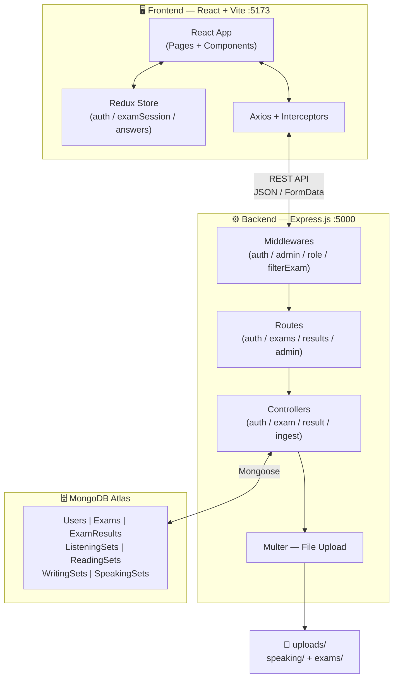
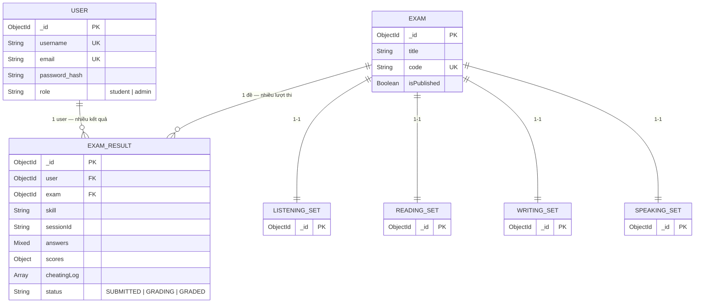
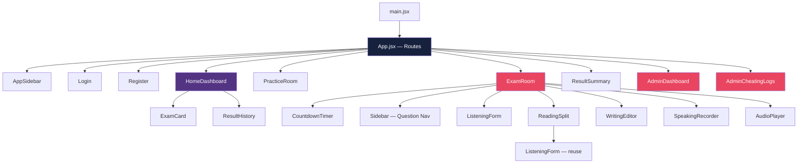
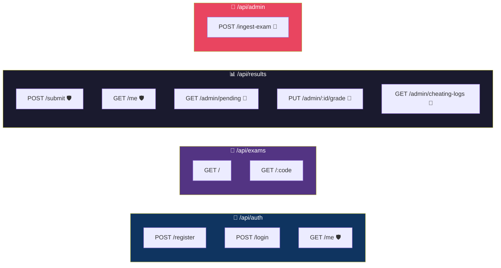

# 📊 SƠ ĐỒ TỔNG QUAN DỰ ÁN EXAMTIME

---

## 1. Kiến trúc Hệ thống (System Architecture)

---

## 2. Quan hệ Cơ sở dữ liệu (Database ERD)

---

## 3. Cây Component Frontend

---

## 4. Bản đồ API Endpoints

> 🛡️ = cần đăng nhập &nbsp;&nbsp; 👑 = cần quyền admin

---

> 💡 Để xem sơ đồ, cài extension **"Markdown Preview Mermaid Support"** trong VS Code rồi bấm `Ctrl+Shift+V`.
